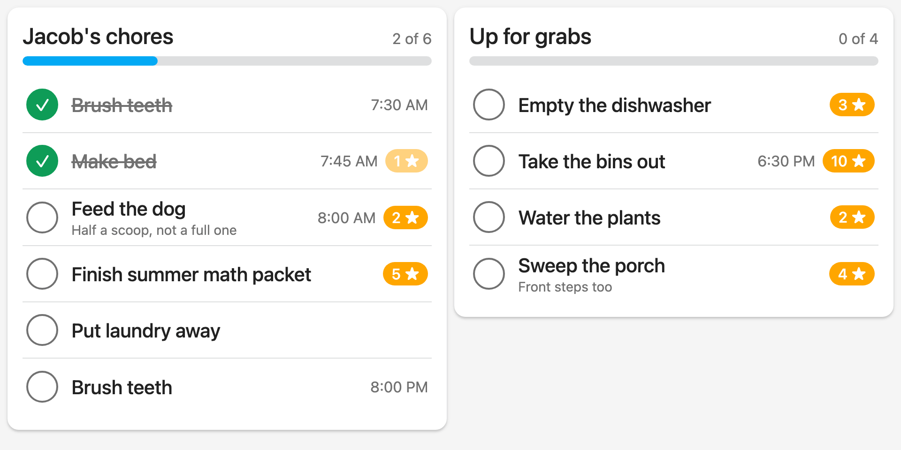
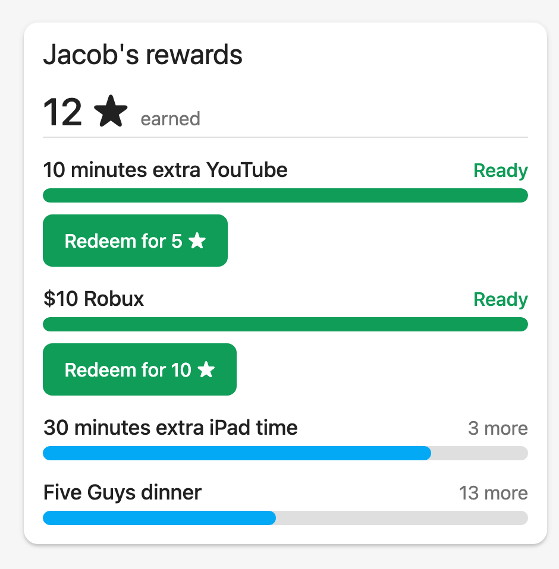

# Building a dashboard

Worked examples for laying the integration's entities out. Everything here is plain
Lovelace YAML using built-in cards — paste it into a dashboard's raw configuration editor
and change the entity ids to yours.

**Do not trust the entity ids below — look yours up.** They are written as though the
frame's name and the profile's decide them, so `The Knowles` with a child called `Jacob`
gives `sensor.the_knowles_jacob_reward_points`. That is only where an id *starts*. Home
Assistant fixes an entity id the first time the entity is registered and never revises it,
so renaming a frame, or an entity added under an older version of this integration, leaves
an id that no longer matches the pattern — one real install has
`todo.kitchen_the_knowles_up_for_grabs` sitting alongside `todo.the_knowles_jacob_chores`.

Copy each id from **Developer tools → States**, filtering on `skylight`. A dashboard
pointed at an id that does not exist renders an *Entity not found* card rather than an
error, which is easy to read as the integration being broken.

## The family view

One column per person, plus the household calendar. This is the layout the frame itself is
closest to.

```yaml
type: sections
title: Family
sections:
  - type: grid
    cards:
      - type: heading
        heading: Jacob
      - type: todo-list
        entity: todo.the_knowles_jacob_chores
      - type: entities
        entities:
          - entity: sensor.the_knowles_jacob_chores_due
            name: Still to do
          - entity: sensor.the_knowles_jacob_reward_points
            name: Stars

  - type: grid
    cards:
      - type: heading
        heading: Everyone
      - type: todo-list
        entity: todo.the_knowles_up_for_grabs
      - type: todo-list
        entity: todo.the_knowles_grocery_list

  - type: grid
    cards:
      - type: heading
        heading: Calendar
      - type: calendar
        entities:
          - calendar.the_knowles_calendar
        initial_view: listWeek
```

Checking off an *Up for Grabs* chore credits whoever ticked the box, so that card only
works properly for someone signed in as themselves — see
[Up for Grabs chores](../README.md#up-for-grabs-chores).

## A child's chore screen

A wall display in a child's room, signed in as that child, is the case the *Up for Grabs*
list was built for: Home Assistant knows who tapped, so the chore is credited to them
without anyone choosing a name first. A frame does not do this — everyone shares one
screen, so claiming a chore there means picking yourself out of a list.

The layout below is for a small landscape display — it was written against an Echo Show 5
(960×480), and anything of roughly that shape will do. Two columns, no keyboard, and rows
big enough to hit with a thumb.

<picture>
  <source media="(prefers-color-scheme: dark)" srcset="images/echo-show-dark.png">
  
</picture>

*The whole screen at its real size, 960×480.*

```yaml
views:
  - title: Chores
    path: chores
    type: sections
    max_columns: 2
    sections:
      - type: grid
        cards:
          - type: custom:skylight-chores
            entity: todo.the_knowles_jacob_chores
            title: Jacob's chores

      - type: grid
        cards:
          # Note the id: this list predates a rename on the install it came
          # from, so it does not match the pattern the others follow. Yours may
          # or may not — look it up.
          - type: custom:skylight-chores
            entity: todo.kitchen_the_knowles_up_for_grabs
            title: Up for grabs
```

That is the whole screen. `skylight-chores` ships with the integration — nothing to
install, and it appears in the card picker as *Skylight chores* with a visual editor.

| Option | Default | |
| --- | --- | --- |
| `entity` | — | The chore list. Required. |
| `title` | none | Shown at the top. Omit it and the card has no heading. |
| `show_progress` | `true` | The `3 of 7` count and the bar under the title. |
| `hide_completed` | `false` | Drop finished chores instead of striking them through. The count still counts them. |
| `done_message` | `🎉 All done!` | What replaces the count when everything is checked off. |
| `text_scale` | `1` | Sizes the whole card. Below 1 fits more chores on a short screen; clamped to 0.6–1.5. |

### What it does that a to-do list does not

A chore chart is a to-do list only in the sense that both have rows and checkboxes. The
differences are all about one child, one day, and a screen on a wall:

**The whole row is the button**, sized for a thumb rather than a mouse pointer, so there is
no few-millimetre checkbox to aim at and no edit dialog to dismiss.

**Reward points are a badge.** A to-do item has six fields and no room for a seventh, so
the integration writes a chore's points into its description as `⭐ 2`, above whatever the
chore already said. The built-in card renders that as body text under the summary; this one
lifts it out into a badge and leaves the chore's real notes underneath.

**A chore with a time of day shows it.** A chart with "Brush Teeth" in the morning and
again at bedtime produces two rows with the same name on the same day, and the time is the
only thing that tells them apart. Times follow the 12- or 24-hour setting in your Home
Assistant profile, not the browser's.

**How much is left is drawn at the top**, rather than needing a separate progress sensor
and a heading card, and it turns green with *🎉 All done!* when the chart is clear.

**A tap changes the row immediately.** Checking a chore off is a write to Skylight's
servers followed by a poll, which is comfortably long enough for a child to conclude the
screen is broken and tap again. The tick appears at once and is quietly put back if the
write turns out to have failed — with the reason above the list, not in place of it.

**There is no add field, no sort menu and no reordering.** None of them belong on a child's
wall, and the order the chores are in is the order somebody arranged them in on the frame.

**It can be sized to the screen.** A wall display is read from across a room but is often
physically small — an Echo Show 5 is 960×480 in about five inches — so `text_scale` sizes
the whole card at once: text, checkbox, padding and row heights together. `0.7` fits nine
chores where the default fits seven. The visual editor offers it as a slider, which is the
sensible way to find the right value: look at the display and drag.

Row height stops shrinking at 44px however small the text gets. That is the smallest touch
target the accessibility guidelines allow, and shrinking the thing a child has to hit is a
different trade from shrinking what they read.

None of this needs [card-mod](https://github.com/thomasloven/lovelace-card-mod) or any
other frontend add-on.

### Without the custom card

The built-in `todo-list` card works, and is what to reach for if you want the edit dialog,
drag-to-reorder, or an *Add item* field:

```yaml
- type: todo-list
  entity: todo.the_knowles_jacob_chores
  hide_create: true
  display_order: none
  item_tap_action: toggle
```

`item_tap_action: toggle` is the important one. By default tapping a row opens the edit
dialog and only the checkbox itself checks the item off — a target a few millimetres wide.
With `toggle`, the whole row is the button.

`hide_create: true` removes the *Add item* field. Nothing on this screen should summon a
keyboard, and a chore chart a child can add to is not a chore chart.

`display_order: none` keeps the order the chores are in on the frame, which is the order
someone arranged them in deliberately. Any other value sorts the card and quietly discards
that.

That card sizes itself for a phone held at arm's length rather than a screen across the
room, which is styling, and styling means
[card-mod](https://github.com/thomasloven/lovelace-card-mod):

```yaml
  card_mod:
    style: |
      ha-check-list-item {
        min-height: 60px;
      }
      .summary {
        font-size: 22px;
        font-weight: 500;
      }
      .due {
        font-size: 16px;
      }
      /* Sorting and reordering are not this screen's job. */
      ha-dropdown {
        display: none !important;
      }
```

Leave the due line visible even though it reads "today" on most rows — it is what
distinguishes the morning "Brush Teeth" from the bedtime one.

`card_mod` is an unknown key to Home Assistant if card-mod is not installed, so the
dashboard still renders — just at the default size.

### Getting the screen out of the way

At 960px wide Home Assistant is above its narrow breakpoint, so it docks the sidebar and
draws a header, and between them they take a third of the display. On a wall panel neither
is wanted. [kiosk-mode](https://github.com/NemesisRE/kiosk-mode) removes both — put this at
the top of the same raw configuration:

```yaml
kiosk_mode:
  hide_header: true
  hide_sidebar: true
```

**Not if the dashboard has more than one view.** The header is what draws the tab bar, so
`hide_header` leaves no way to switch between them. Keep the header and strip everything
else off it instead — what remains is the tabs and nothing else:

```yaml
kiosk_mode:
  hide_sidebar: true
  hide_menubutton: true
  hide_account: true
  hide_search: true
  hide_assistant: true
  hide_notifications: true
  hide_overflow: true
```

Two views suit this screen well: chores on one tab and rewards on the other. Rewards want
the full width for a bar per reward beside the redeem buttons, and the chore lists want
every pixel of height they can get — sharing one view costs both.

The rest is the device. Sign the browser in as the child's own Home Assistant user —
that login is what makes an *Up for Grabs* chore land on the right chart, and a shared or
admin login silently credits the wrong person. Then point it at
`/lovelace-chores/chores` and let it stay there.

## Rewards

Each reward is a `number` whose value is its point cost, with four attributes:

| attribute | |
| --- | --- |
| `balance` | the profile's current points |
| `affordable` | whether the balance covers the cost |
| `progress` | how far towards it, 0–100, capped |
| `points_needed` | how many more, 0 once affordable |

`progress` and `points_needed` are derived in the integration rather than left to a
template, because a dashboard cannot divide one entity by another. All four read `unknown`
for a profile with no recorded balance, which is not the same as a profile with zero
points.

Redeeming is an action, so a button card with a `tap_action` is how it goes on a
dashboard:

```yaml
type: entities
title: Jacob's rewards
entities:
  - entity: number.the_knowles_jacob_10_robux
    name: $10 Robux
  - type: button
    name: Redeem $10 Robux
    icon: mdi:gift-open-outline
    tap_action:
      action: perform-action
      perform_action: skylight.redeem_reward
      target:
        entity_id: number.the_knowles_jacob_10_robux
```

To grey the button out when the balance will not cover it, use a `conditional` card on the
reward's `affordable` attribute:

```yaml
type: conditional
conditions:
  - condition: state
    entity: number.the_knowles_jacob_10_robux
    attribute: affordable
    state: true
card:
  type: button
  name: Redeem $10 Robux
  tap_action:
    action: perform-action
    perform_action: skylight.redeem_reward
    target:
      entity_id: number.the_knowles_jacob_10_robux
```

### Rewards on a child's screen

What a child wants from this is not a list of prices — it is how close they are.

The integration ships a card for exactly this:

<picture>
  <source media="(prefers-color-scheme: dark)" srcset="images/rewards-dark.png">
  
</picture>

```yaml
type: custom:skylight-rewards
profile: Jacob
```

That is the whole configuration. Every reward belonging to that profile appears, nearest
first, with a bar showing how close it is and a redeem button on the ones in reach. Add a
reward on the frame and it appears; rename one and the card follows.

`profile` is the profile's name as the frame spells it — the same name on the chore chart.
There is a visual editor, so adding the card from the picker and choosing a profile from a
dropdown is enough; the YAML above is what that produces.

The card also shows the profile's star balance at the top, read from the rewards
themselves rather than from a separate sensor. `show_balance: false` hides it. A profile
with no balance recorded shows no total rather than a zero, since those are different
things.

**Nothing to install.** The card is served by the integration and registered with the
frontend, so there is no HACS plugin, no resource to add, and no version to keep in step.
It arrives with the integration and updates with it.

#### If the card does not appear on one device

This applies to both cards the integration ships, and to a device rather than to a card:
they arrive by the same route, so a display missing one is usually missing both.

**Since 2026.8.11 this should not happen.** The cards are also listed in your Lovelace
resources, which the frontend fetches over the websocket each time a dashboard opens, so
there is no cached page in the way. If a device is still missing a card, reload the
dashboard once — and if that does not do it, the rest of this section is why.

The other registration adds a `<script type="module">` to the page Home Assistant serves,
which means two things can go wrong on one device while every other device is fine.

**A stale page.** The script tag is part of the index Home Assistant renders, so a display
that has had the dashboard open since before the upgrade never fetched it. Kiosk browsers
are the usual culprits, since they are built to hold one page. Close the browser fully and
reopen it, or clear its cache — not a refresh, which may reuse the same index.

**A browser without ES module support.** Home Assistant ignores module scripts on those and
serves its own legacy bundle, so the card never loads at all. Anything from the last several
years is fine; an old Android WebView on a repurposed display may not be.

Loading it as a Lovelace resource works around both, because resources are fetched while
the dashboard renders rather than baked into the page. **That is what the integration now
does for you**, so this is only worth doing by hand if Lovelace is in YAML resource mode —
where the list comes from `configuration.yaml` and nothing may add to it:

```yaml
lovelace:
  resources:
    - url: /skylight/frontend/skylight-rewards.js
      type: module
    - url: /skylight/frontend/skylight-chores.js
      type: module
```

In storage mode, the equivalent is **Settings → Dashboards → three dots → Resources**,
where you will find both already listed. An entry added by hand at that same path is
adopted rather than duplicated — it gets repointed at the current version on the next
restart.

Those are the same files the integration already serves — no download, no HACS entry, and
they stay in step with the integration. A card reached both ways is fetched once, since a
module is keyed by its url; and were it ever loaded twice, whichever arrives second sees
the element is defined and does nothing.

To tell the two causes apart before reaching for that, open
`/skylight/frontend/skylight-rewards.js` in the failing device's own browser. JavaScript
means the file is served and the page is not loading it; anything else is a different
problem.

The rest of this section is the same thing built out of generic cards, which is worth
keeping for two reasons: it shows what the attributes are for, and it still applies to
anyone assembling a different layout.

**Do not list the rewards.** They are created and renamed on the frame, so a card naming
four entity ids is wrong the moment somebody adds a fifth, and silently: a card pointed at
a reward that no longer exists just stops showing it. Every reward carries `profile`, so a
template can find them instead.

With [entity-progress-card](https://github.com/francois-le-ko4la/lovelace-entity-progress-card)
and [auto-entities](https://github.com/thomasloven/lovelace-auto-entities), one real
progress bar per reward, generated from whatever rewards exist:

```yaml
type: custom:auto-entities
card:
  type: grid
  columns: 1
  square: false
card_param: cards
show_empty: false
filter:
  template: |
    
    
      
      {{ { 'type': 'custom:entity-progress-card',
           'entity': balance,
           'max_value': {'entity': reward.entity_id},
           'name': reward.attributes.reward,
           'icon': 'mdi:star-circle',
           'unit': ' ',
           'decimal': 0,
           'bar_color': 'var(--success-color)' if needed == 0 else 'var(--primary-color)',
           'custom_info': ('Ready!' if needed == 0 else needed ~ ' more'),
           'tap_action': {'action': 'none'} } | to_json }},
    
```

**The card computes the percentage itself, from two entities.** `entity` is the profile's
point balance and `max_value` names the reward's cost entity, so the bar is balance over
cost.

`max_value` takes an object, not an entity id. Its schema is a number, or
`{entity, attribute}`, or `{jinja}` — the card says it uses an explicit shape rather than
guessing whether a bare string is an entity id or a template. The card's README shows
`max_value: sensor.something`, which the schema rejects; that produces one configuration
error per card and no other clue.

The obvious configuration — point the card at the reward and read its `progress`
attribute — does not work, and fails without saying why. The card special-cases a `number`
entity and uses its value directly:

> Counter or Number value: … it uses the provided value directly from the entity. … Attribute
> will not be used.

A reward *is* a `number`, whose value is its cost, so `attribute` is ignored and the bar
measures the price rather than the progress towards it.

`tap_action: none` deliberately. The bars are information and the redeem buttons below are
the action — a redemption is irreversible, and a bar that spends points when a child pokes
it is a bad surprise.

`| to_json` rather than letting the dict render as Python. Both usually work — Python's
repr quotes a name containing an apostrophe correctly — but repr can emit things YAML reads
differently or not at all, `None` and tuples among them. JSON is valid YAML, so `to_json`
takes the question off the table.

`custom_info` is documented as taking a template, but the value here is computed while the
outer template runs. Emitting a template inside a template is asking the wrong engine to
resolve it, and auto-entities re-renders on every state change anyway, so the plain string
stays current.

### Without those cards

A markdown card, which needs no dependencies at all:

```yaml
type: markdown
text_only: true
content: |
  
  
  
  
  **{{ reward.attributes.reward }}** — {{ reward.state | int(0) }} ⭐ {{ '★' * filled }}{{ '☆' * (10 - filled) }} **Ready!**{{ needed }} more
  
```

**`content: |`, not `content: >-`.** A folded scalar turns every newline into a space, so
the whole list renders as one run-on line — every reward present, none of them legible. A
literal block keeps the line structure the output depends on. This is easy to get wrong and
hard to spot in the YAML, because the template is correct either way; only the string
Home Assistant receives differs.

Each reward is one line with a blank line after it, so it becomes its own markdown
paragraph. Splitting the name and the bar across two lines would not work: markdown folds a
single newline into a space, and the fix for that is trailing double spaces, which a
whitespace-trimming editor or pre-commit hook will silently eat.

**Sort on `points_needed`, not on the state.** The state is the cost, and it is a string, so
`"10"` sorts before `"5"`. `points_needed` is a number, and ordering by it puts the nearest
reward at the top — which is the same order as by price, and the more useful sentence.

Do not reach for building a list and sorting that. Home Assistant's Jinja is sandboxed and
refuses `list.append`:

```
SecurityError: access to attribute 'append' of 'list' object is unsafe.
```

A card whose template raises renders as nothing at all, so the mistake looks like missing
data rather than a broken template.

Change `'Jacob'` to the profile you want. The match is on the profile's label as the frame
reports it, which follows a rename on the frame without a reload — unlike the entity id,
which never changes once assigned.

The buttons need [auto-entities](https://github.com/thomasloven/lovelace-auto-entities),
because no built-in card builds cards from data. With it the whole section stays
dynamic — a button for each affordable reward, and none at all when he cannot afford
anything:

```yaml
type: custom:auto-entities
card:
  type: grid
  columns: 2
  square: false
card_param: cards
# Nothing affordable renders no cards at all, so without this the section leaves
# an empty grid behind on the days he has not earned anything yet.
show_empty: false
filter:
  template: |
    
      {{ { 'type': 'button',
           'name': reward.attributes.reward,
           'icon': 'mdi:gift-open-outline',
           'tap_action': { 'action': 'perform-action',
                           'perform_action': 'skylight.redeem_reward',
                           'target': { 'entity_id': reward.entity_id } } } }},
    
```

auto-entities parses the template's output as YAML, so what the template emits has to be a
comma-separated list of card configs — hence the trailing comma inside the loop, which
looks like a typo and is not.

Without that dependency, one `conditional` card per reward, each appearing only when it
can succeed. Hard-coded, so a reward added on the frame will not get a button until
someone adds one:

```yaml
type: conditional
conditions:
  - condition: state
    entity: number.the_knowles_jacob_10_robux
    attribute: affordable
    state: true
card:
  type: button
  name: Redeem $10 Robux
  icon: mdi:gift-open-outline
  show_state: false
  tap_action:
    action: perform-action
    perform_action: skylight.redeem_reward
    target:
      entity_id: number.the_knowles_jacob_10_robux
```

A button that is absent until it works beats one that is greyed out: there is nothing to
tap hopefully, and nothing that fails with an error a child cannot act on.

Redeeming is not confirmed and cannot be undone. On a screen a child uses unsupervised
that is the point — see the automations below for how to hear about it — but on a shared
tablet, `confirmation` on the `tap_action` is worth adding.

## Hearing about rewards

Two blueprints, in
[`blueprints/automation/skylight/`](../blueprints/automation/skylight). Import either by
pasting its URL into **Settings → Automations & scenes → Blueprints → Import blueprint**:

| | |
| --- | --- |
| [Reward within reach](https://github.com/dknowles2/ha-skylight/blob/main/blueprints/automation/skylight/reward_within_reach.yaml) | someone has earned enough points to redeem something |
| [Reward redeemed](https://github.com/dknowles2/ha-skylight/blob/main/blueprints/automation/skylight/reward_redeemed.yaml) | someone redeemed one |

They are not installed with the integration. Home Assistant only discovers blueprints under
your own `blueprints/` folder — an integration cannot ship them — and the release zip
contains just the component, so importing by URL is the route.

Both guard against firing on restart, which the hand-written versions below do not. A
restart re-creates every entity with no previous state, so every reward already in reach
would announce itself as though it had just been earned.

Both also take the notification as an input rather than assuming one, so a mobile
notification, a TTS announcement on the kitchen speaker, or a light flash are all the same
blueprint. The variables they expose are listed in each input's description.

### Writing them by hand instead

The same two automations without the blueprints, if you would rather own the YAML. Neither
has the restart guard.

**When he can afford something new.** `affordable` flipping to true is the trigger, one per
reward, so each reward announces itself once as it comes into reach rather than every poll:

```yaml
alias: Jacob can afford a reward
triggers:
  - trigger: state
    entity_id:
      - number.the_knowles_jacob_10_minutes_extra_youtube_shorts
      - number.the_knowles_jacob_10_robux
      - number.the_knowles_jacob_30_minutes_extra_ipad_time
      - number.the_knowles_jacob_five_guys_dinner
    attribute: affordable
    to: true
actions:
  - action: notify.mobile_app_your_phone
    data:
      title: Jacob has earned a reward
      message: >-
        {{ trigger.to_state.attributes.friendly_name }} is now within reach —
        {{ trigger.to_state.attributes.balance }} points.
mode: queued
```

Every reward he can already afford fires this the first time Home Assistant restarts, and
each one fires again whenever a redemption drops his balance below the price and chores
bring it back. Both are correct, and both are noisier than they sound with four rewards.
Narrowing `entity_id` to the one or two that matter is the usual fix.

**When he redeems one.** This needs no reward entity at all — the frame reports every
redemption, whoever made it and wherever it happened:

```yaml
alias: Jacob redeemed a reward
triggers:
  - trigger: state
    entity_id: event.the_knowles_reward_redeemed
actions:
  - action: notify.mobile_app_your_phone
    data:
      title: Reward redeemed
      message: >-
        {{ state_attr('event.the_knowles_reward_redeemed', 'profile') }} redeemed
        {{ state_attr('event.the_knowles_reward_redeemed', 'reward') }}
        for {{ state_attr('event.the_knowles_reward_redeemed', 'point_value') }} points.
```

Because this watches the frame rather than the dashboard, it fires for a redemption made on
the frame itself, from the Skylight app, or from this integration — which is what makes it
the one to rely on. Filter on the `profile` attribute if more than one person has rewards.

Skylight has no notion of *requesting* a reward, only of redeeming one: there is no pending
or approval state anywhere in its API, and every endpoint that might hold one returns 404.
A request-and-approve flow would therefore be a Home Assistant invention, and one a child
could sidestep by walking to the frame.

## Awarding stars from a dashboard

```yaml
type: entities
title: Stars
entities:
  - entity: sensor.the_knowles_jacob_reward_points
    name: Jacob
  - type: button
    name: Give Jacob a star
    icon: mdi:star-plus-outline
    tap_action:
      action: perform-action
      perform_action: skylight.award_points
      target:
        entity_id: sensor.the_knowles_jacob_reward_points
      data:
        points: 1
```

`skylight.deduct_points` takes the same shape. Skylight does not stop at zero, so a
mis-tap can leave a negative balance — worth keeping the deduct button off a wall tablet.

## Sending a recipe to the grocery list

```yaml
type: button
name: Taco night
icon: mdi:chef-hat
tap_action:
  action: perform-action
  perform_action: skylight.add_recipe
  target:
    entity_id: todo.the_knowles_grocery_list
  data:
    recipe: Taco Night
```

The ingredients arrive a few seconds after the tap, not instantly — Skylight parses them
out of the recipe on its own servers.

## Reacting to the frame

The `event` entities carry what happened in their attributes, which a markdown card can
read directly:

```yaml
type: markdown
content: >-
  
  
    **{{ e.attributes.profile }}** finished *{{ e.attributes.chore }}*
    {{ relative_time(e.attributes.completed_at | as_datetime) }} ago
  
    Nothing completed yet today.
  
```

For notifications rather than display, trigger an automation off the same entity — there
is an example in the [README](../README.md#reacting-to-what-happens-on-the-frame).

## Progress meters

Three percentage sensors per profile, each carrying `completed`, `due` and `total` as
attributes:

| | covers |
| --- | --- |
| `sensor.<frame>_<profile>_chores_progress` | the whole chart |
| `sensor.<frame>_<profile>_routine_progress` | chores Skylight marks as part of a routine |
| `sensor.<frame>_<profile>_other_chores_progress` | everything else |

The split is the API's own `routine` flag, not a guess from the clock. On a real chart it
separates getting-ready chores — which all carry a time of day — from open-ended ones like
a summer reading assignment.

Gauges take one entity and a fixed maximum, which is why these are percentages rather than
counts: nothing on a dashboard can divide `chores_completed` by a total.

Their icon fills as the number climbs — an empty circle at 0%, a full one at 100% — so an
`entities` card or a badge reads at a glance without a gauge at all. A profile with nothing
on their chart shows a question mark rather than an empty circle, since an empty circle
would claim nothing had been done.

```yaml
type: horizontal-stack
cards:
  - type: gauge
    entity: sensor.the_knowles_jacob_routine_progress
    name: Getting ready
    min: 0
    max: 100
    severity:
      green: 100
      yellow: 50
      red: 0
  - type: gauge
    entity: sensor.the_knowles_jacob_other_chores_progress
    name: Chores
    min: 0
    max: 100
```

A profile with nothing on their chart reads **unknown**, not 0% or 100% — both would be
claims about a chart that does not exist. A gauge renders that as empty, so wrap it in a
conditional card if the dashboard covers people who do not always have chores:

```yaml
type: conditional
conditions:
  - condition: state
    entity: sensor.the_knowles_jacob_routine_progress
    state_not: unknown
card:
  type: gauge
  entity: sensor.the_knowles_jacob_routine_progress
  name: Getting ready
```

## A note on what not to build

Chore counts are also available as `sensor.<frame>_<profile>_chores_due` and
`_chores_completed`, which are useful in automations and templates but say less than the
to-do card does. Prefer the card where there is room for it.

**Up for Grabs has no progress sensor, and cannot have one.** A chore drops out of the
only endpoint that returns unclaimed chores the moment somebody completes it, so the
number still open is observable and the number there were is not. A percentage built on
that would climb and reset as chores were claimed, describing nothing.
